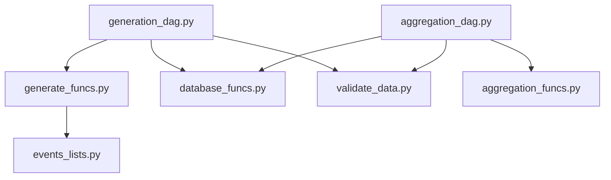

## Предварительные настройки

1. выполнить команду:
`docker-compose up`

2. Войти через интерфейс:
**логин**: airflow
**пароль**: airflow

3. Создать в соединение для работы с базой:

    **3.1.** перейти в раздел Admin > Connections

    **3.2.** создать соединение со следующими параметрами:

        - connection_id : source_base
        - conn type : postgres
        - host : postgres-source
        - port : 5432
        - login: source_user
        - password : test_

## Структура базы данных

Создана база данных Log при инициализации контейнера в Докере. В скрипт развертывания структуры базы находится **database_creating.sql**.
Создана схема log.Созданы четыре таблицы:

- log.users
- log.messages
- log.topics
- log.logs

Таблицы *log.messages* и *log.topics* представлены для описания структуры данных в базе, реально в процессе работы дагов не участвуют.

Для работы таблицы *log.logs* созданы два перечисления *enum_event_type* и *enum_object_type*.

Партиционирование таблицы логов настроено по полю *log_time* с диапазоном времени в партиции равным одному месяцу. 
Такое партиционирование позволяет управлять хранением логов помесячно.
Основной ключ таблицы представлен сочетанием guid пользователя и временем события, изходя из идеи, что не может быть 
двух разных событий от одного пользователя в одно время.

Так как логи предназначены для проверки действий пользователей, то реализованы индексы для поиска по типам событий (*idx_logs_object_audit*)
и провекри ответов сервера (*idx_logs_error_analysis*)

Такие объекты, как *topic* и *message* хранятся в отдельных таблицах, так как имеют дополнительные параметры, а в логе отражаются 
типом (*object_type*) и guid объекта (*object_id*) из соответствующей таблицы.

Табоица *log.users* содержит информацию о посетителях (присвоен только уникальных guid) и зарегистрированных пользователях
(заполнены все поля). Это позволяет определять действия одного пользователя до регистрации и после (определение личности происходит по косвенным 
признакам, например метаданным в Cookie).

## DAG-и
Присутствует два дага:

- forum_data_generation (файл **generation_dag.py**)
- forum_log_aggregation (файл **aggregation_dag.py**)

Первый запускается вручную и генерирует данных за предыдущие 35 дней относительно дня запуска.
Второй даг также запускается вручную и позволяет выбрать в качестве параметра день расчета в поле вида "Календарь".
К сожалению насройки параметра не позволяют назначить периодичность автоматического запуска, так как возникает коллизия типов данных.

После отработки первого дага в таблицах *log.users* и *log.logs* появляются сгенерированные данных. 
Количество сгенерированных посетителей 500, примерно поровну зарегистрированных и не зарегистрированных. 
Далее идет генерация действий пользователей по дням. Рандомно идет определение был ли пользователь активен на конкретный день, 
после идет генерация действий пользователя от 5 до 12 в день, так же случайным образом.

На этапе проверки проходит проверка типов и правил заполнения потей (simple_validation).
После проходит проверка логических коллизий: наличие logout повторно, попытка создания топика не зарегистрированным пользователе.

При наличии ошибок, строки удаляются их фрема, в логах таски остается сообщение. данные проверяются последовательно, 
модифицируя исходный фрейм данных.

В папке *subs* находятся вспомогательные компоненты:

- **aggregation_funcs.py** - функции для обработки результатов
- **database_funcs.py** - функции работы с базой данных
- **events_lists.py** - списки возможных событий, разделенные по доступности для пользователей (используется в generate_funcs.py)
- **generate_funcs.py** - основные и вспомогательные функции для генерации фейковых данных
- **validate_data.py** - функции проверки данных

Cхема вызовов файлов:

